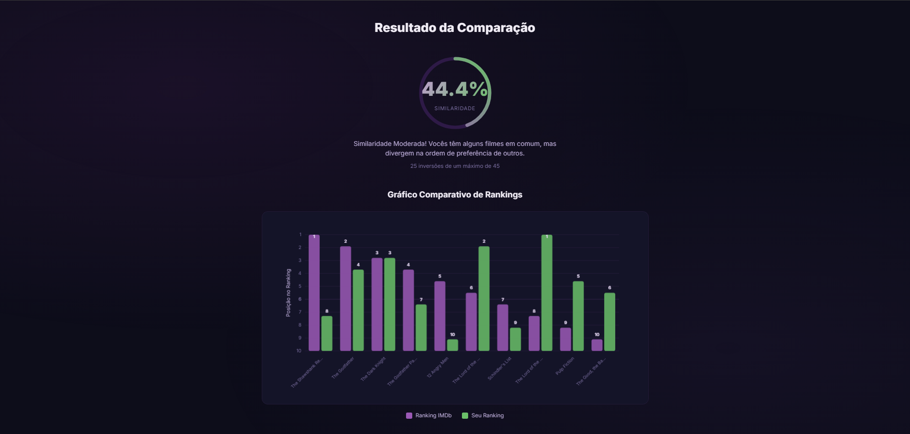
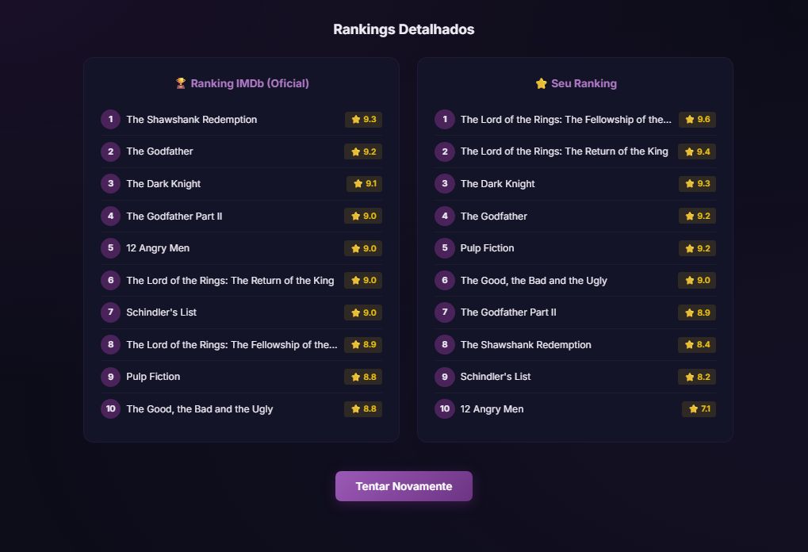

# G34_D-C_PA-26.1

Projeto de comparação de gostos cinematográficos usando o algoritmo de **Contagem de Inversões** (Dividir e Conquistar).
---

## Alunos
|Matrícula | Aluno |
| -- | -- |
| 211062867  |  Felipe de Jesus Rodrigues |
| 211043763  |  Ruan Sobreira Carvalho |

## Programas disponíveis

| Arquivo | Descrição |
|---|---|
| `main.py` | Compara os rankings de dois usuários a partir de uma lista fixa de 10 filmes |
| `imdb-API.py` | Compara o gosto do usuário com o ranking oficial do Top IMDb usando notas de 0 a 10 |

---

## Configuração da chave de API (necessário apenas para `imdb-API.py`)

O `imdb-API.py` busca os filmes diretamente do IMDb via [RapidAPI](https://rapidapi.com). Siga os passos abaixo para configurar:

### 1. Criar conta no RapidAPI

Acesse [https://rapidapi.com](https://rapidapi.com) e crie uma conta gratuita.

### 2. Assinar a API imdb236

1. Acesse [https://rapidapi.com/rapidapi-org1-rapidapi-org-default/api/imdb236/playground/apiendpoint_28f544bf-846a-4ee3-a876-6ee0488af568](https://rapidapi.com/rapidapi-org1-rapidapi-org-default/api/imdb236/playground/apiendpoint_28f544bf-846a-4ee3-a876-6ee0488af568)
2. Clique em **Subscribe to Test** e escolha o plano **Basic (Free)**

### 3. Copiar sua chave

1. No menu superior, acesse **Apps → My Apps → Default App → Authorization**
2. Copie o valor de **X-RapidAPI-Key**

### 4. Criar o arquivo `.env`

Na raiz do projeto, crie um arquivo chamado `.env` com o seguinte conteúdo:

```
RAPIDAPI_KEY=sua_chave_aqui
```

---

## Como executar

```bash
# Comparação entre dois usuários (lista fixa de 10 filmes)
python3 main.py

# Comparação com o Top IMDb (requer .env configurado)
python3 imdb-API.py
```

---

## Como o algoritmo funciona

1. Cada usuário define sua ordem de preferência dos filmes
2. O ranking do segundo usuário é convertido em uma **permutação** relativa ao primeiro
3. O algoritmo conta as **inversões** nessa permutação usando Merge Sort modificado
   - Uma inversão ocorre quando um filme aparece "fora de ordem" em relação ao outro ranking
   - Cada vez que um elemento da metade direita é menor que um da esquerda, somamos todos os elementos restantes da esquerda de uma vez (`len(left) - i`)
4. O número de inversões é normalizado pelo máximo possível `n*(n-1)/2` para gerar um score de 0% a 100%

| Inversões | Similaridade |
|---|---|
| 0 | 100% — gostos idênticos |
| ≤ 25% do máximo | Alta similaridade |
| ≤ 75% do máximo | Similaridade moderada |
| < máximo | Baixa similaridade |
| = máximo | 0% — gostos opostos |

---

## Visão geral do projeto

Este repositório contém o CineRank — um sistema para comparar preferências cinematográficas. Ele oferece duas formas de uso:

- CLI: comparar dois usuários usando uma lista fixa de 10 filmes (`main.py`).
- Integração com o Top IMDb: avaliar `n` filmes do Top IMDb e comparar suas notas com o ranking oficial (`imdb-API.py` / interface web).

Tecnologias principais:

- Python 3 (lógica do algoritmo)
- Flask (servidor que entrega a interface web em `server.py`)
- Frontend estático (HTML/CSS/JS em `web/`)

## Imagens (exemplo)

Carrossel de avaliação:


Tela de resultados (gráfico e tabelas comparativas):



Comparação detalhada dos rankings:



## Como executar (detalhado)

1. (Opcional) Crie e ative um virtualenv:

```bash
python3 -m venv .venv
source .venv/bin/activate
```

2. Instale dependências mínimas (apenas para a interface web):

```bash
pip install Flask
```

3. (Opcional) Configure a chave da API RapidAPI para usar o Top IMDb:

Crie um arquivo `.env` na raiz do projeto com o conteúdo:

```
RAPIDAPI_KEY=sua_chave_aqui
```

4. Executar a interface web (abre em http://127.0.0.1:5000):

```bash
python3 server.py
```

5. Executar em terminal:

```bash
# Compara dois usuários (lista fixa de 10 filmes)
python3 main.py

# Compara suas notas com o Top IMDb (requer .env)
python3 imdb-API.py
```

# Vídeo apresentação

O vídeo de apresentação pode ser acessado clicando no link abaixo.

[Apresentação](https://youtu.be/ZnMniWP30Ho)
	
